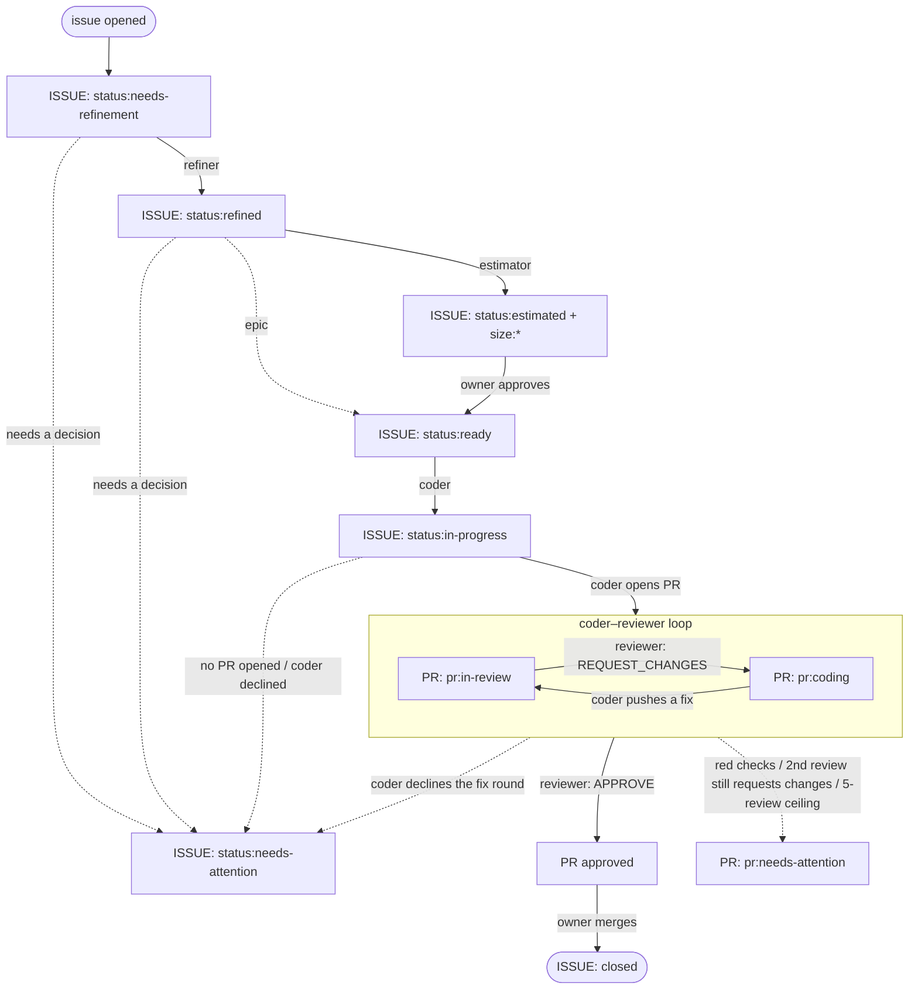

# interns

A tireless team of interns that refine issues, estimate them, open PRs, and  review each other's work — with a human in
the loop when really needed.

The pipeline drives [Claude Code](https://github.com/anthropics/claude-code) over a checked-out repo, respects its `CLAUDE.md` / `AGENTS.md`, and runs
entirely in the consumer repo's GitHub Actions — no hosted service.

Status: early. Consumed by [`abi83/prepify`](https://github.com/abi83/prepify).
Design and roadmap: [#3](https://github.com/abi83/interns/issues/3).

## What it does

Four agents pick issues up by label and hand them along a fixed track:

| Agent | Trigger | Does | Leaves |
|---|---|---|---|
| **Refiner** | `status:needs-refinement` on an issue | picks the type, checks the draft against the codebase and wiki, rewrites the body into the type's template, posts a blockers/dependencies comment | `status:refined` |
| **Estimator** | `status:refined` | reads the code the Scope touches, scores blast radius / touch / human involvement / review overhead, rolls that into a size | `status:estimated` + `size:*` |
| **Coder** | `status:ready` (owner-approved) on a `type:coding-task` or `type:bug` | implements every Acceptance Criteria item, writes tests, opens a PR that `Closes #N` | `status:in-progress`, a PR labelled `pr:in-review` |
| **Reviewer** | a PR opened/updated by the coder (or a human) | waits for the `test` / `build` checks, reviews the diff against the linked issue, submits `APPROVE` or `REQUEST_CHANGES` | PR approved, or a coder fix round, or `pr:needs-attention` |

The human owner does two things: approve the estimate (move `status:estimated`
→ `status:ready`), and merge the final PR. Everything between is automated, and
anything the automation can't finish is parked on `status:needs-attention` /
`pr:needs-attention` rather than guessed at.



## Label state machine

The installer syncs these from the versioned manifest
([`.github/labels.json`](.github/labels.json)). Label sync is additive — labels
not in the manifest are left alone.

### `status:*` — issue lifecycle (mutually exclusive)

| Label | Meaning                                                | Set by                                                                      | Moves to                                                                                                                                                                       |
|---|--------------------------------------------------------|-----------------------------------------------------------------------------|--------------------------------------------------------------------------------------------------------------------------------------------------------------------------------|
| `status:needs-refinement` | awaiting the refiner                                   | **human**, triggers the refinement-estimation pipeline                      | `status:refined`, or `status:needs-attention` if the refiner needs a decision                                                                                                  |
| `status:refined` | refined, awaiting estimation                           | refiner                                                                     | `status:estimated` (+ `size:*`); `status:ready` directly for a `type:epic`; `status:needs-attention` if unsizeable                                                             |
| `status:estimated` | estimated — waiting on the owner to approve or comment | estimator                                                                   | `status:ready` set by a human to trigger the coder, or a human **comment** to trigger conversational follow-up (TBD, [#11](https://github.com/abi83/interns/issues/11)). |
| `status:ready` | approved for the coder                                 | **human**, triggers the coder-reviewer pipeline; or the estimate phase, for a `type:epic` (bypasses sizing) | `status:in-progress` when the coder starts; `status:needs-attention` if the issue isn't a `type:coding-task` / `type:bug`                                                      |
| `status:in-progress` | a coder-reviewer loop is in progress                   | coder                                                                       | issue closed on merge, or `status:needs-attention`                                                                                                                             |
| `status:needs-attention` | pipeline stalled — a human needs to look               | any agent                                                                   | cleared when a human re-dispatches (the coder drops it on pickup)                                                                                                              |

### `pr:*` — PR pipeline (mutually exclusive)

Once the coder opens a PR the work enters the **coder–reviewer loop**: the
reviewer holds `pr:in-review`, and on `REQUEST_CHANGES` it hands back to the
coder as `pr:coding`; the coder pushes a fix and hands back as `pr:in-review`.
Two limits bound the loop:

- **One automatic fix round.** The coder gets a single fix attempt. If the
  reviewer's *second* review still requests changes, the PR goes to
  `pr:needs-attention` — the automatic loop didn't converge.
- **Five reviewer runs per PR, hard.** A backstop for after escalation: a human
  can keep pushing commits and each one still spawns a reviewer run. At 5 total
  reviews on the PR, automatic review stops entirely and stays manual.

Red `test` / `build` checks also send the PR straight to `pr:needs-attention`,
with no fix round.

| Label | Meaning | Set by | Moves to |
|---|---|---|---|
| `pr:coding` | a coder agent is on this PR (a fix round) | reviewer, when it requests changes | `pr:in-review` after the coder pushes |
| `pr:in-review` | a reviewer agent is on this PR | coder, at hand-off | cleared on `APPROVE`; `pr:coding` on `REQUEST_CHANGES`; `pr:needs-attention` on escalation |
| `pr:needs-attention` | PR pipeline stalled — a human needs to look | reviewer gate | cleared by the next agent pickup or an `APPROVE` |

An approved PR carries **no** `pr:*` label — the native review state is the
signal. List the PRs waiting on a human with
`gh pr list --label pr:needs-attention`.

### `type:*` — set by the refiner (or a human at creation), never changed after

| Label | Estimated? | Coder implements? |
|---|---|---|
| `type:coding-task` | yes | yes |
| `type:bug` | yes | yes |
| `type:spike` | yes | no — a human does the investigation |
| `type:epic` | no — skipped straight to `status:ready` | no — a human breaks it into sub-issues |

There is no agent for spikes or epics — the pipeline only refines them (and
estimates the spike). Once refined, the work is a human's: a spike that reaches
`status:ready` (or an epic, via its estimate-phase bypass) is bounced straight
to `status:needs-attention` by the coder's type gate.

### `size:*` and `priority:*`

`size:XS` … `size:XL` are added by the estimator alongside `status:estimated`;
`size:XL` also gets a `SPLIT:` note on the estimate comment. `priority:low` …
`priority:urgent` are owner triage labels — the pipeline reads neither; they
exist for humans sorting the backlog.

## Setup

From a local clone of your repo, with the [GitHub CLI](https://cli.github.com/)
authenticated (`gh auth login`) as an account with **admin access to the
repo** (needed to write repo secrets and variables):

```bash
curl -LsSf https://raw.githubusercontent.com/abi83/interns/v0.1.0/install.sh | sh
```

That's it. The script installs [`uv`](https://docs.astral.sh/uv/) if it's missing,
then runs the `interns-install` CLI. More details under: [`installer/README.md`](installer/README.md).

### What the installer does

`interns-install` runs the steps below, in order, then hands off to
`.github/workflows/install.yml` for the rest. Both halves are idempotent —
re-run either any time to fix drift.

| # | Step | Why                                                                                                                                                                                           |
|---|---|-----------------------------------------------------------------------------------------------------------------------------------------------------------------------------------------------|
| 1 | Check (and fix) default-branch protection | Agent output isn't deterministic — an agent could ignore its instructions and push straight to the default branch. Protection guarantees every change still goes through a human-approved PR. |
| 2 | Check (and enable) GitHub Pages | The dashboard the pipeline reports to deploys here — nothing to look at without it.                                                                                                           |
| 3 | Mint the two GitHub Apps | Separate coder/reviewer identities, so the reviewer can approve the coder's PRs (`claude[bot]` can't approve its own).                                                                        |
| 4 | Write App secrets/variables + `CLAUDE_CODE_OAUTH_TOKEN` | The pipeline's workflows need these to authenticate as the Apps and call Claude.                                                                                                              |
| 5 | Sync labels | Keeps the repo's labels matching the manifest the pipeline reads (`status:*`, `type:*`, etc.) — it can't route issues without them.                                                          |
| 6 | Open the caller-stub PR | Adds the pipeline's own workflows and starter config; merging it finishes setup.                                                                                                          |

#### 1. Default-branch protection

The agents push branches with the consumer repo's own credentials, so no bot
identity (`github-actions[bot]`, `claude[bot]`, the two Apps) may be allowed
to push to the default branch — every change goes through a human-merged PR.
Running this check locally means it uses the admin-scoped `gh` session you
already authenticated for Setup, instead of a second admin-capable token
stored in the repo. What happens, by starting state:

| Default branch | Result |
|---|---|
| already requires a PR review, no bot on the push allowlist | passes |
| unprotected | installer applies the baseline — require a PR + 1 approval, no force-push, no deletion |
| protected, but your `gh` session lacks admin on the repo | **install fails** — re-auth with admin access, then re-run |
| a bot identity is on the push allowlist | **install fails** — remove it, then re-run |

If protection is enforced some other way this check can't see — an org-wide
ruleset, say, rather than classic branch protection — pass
`interns-install --branch-protection-handled-externally` to skip it.

#### 2. GitHub Pages

The dashboard's deploy target. Enabled with the "GitHub Actions" build type
if it's off; passes straight through if it's already on.

#### 3. Two GitHub Apps

`interns-coder` and `interns-reviewer`, minted via the App Manifest flow, one
"Create GitHub App" click each. Separate identities, so the reviewer can
review the coder's PRs. Same permission set, no webhook:

| Permission | Access | Why |
|---|---|---|
| Contents | Read and write | push branches |
| Pull requests | Read and write | open PRs, submit reviews, comment |
| Issues | Read and write | edit labels, comment, rewrite the issue body (the refiner) |
| Checks | Read | reviewer reads check results |
| Metadata | Read | mandatory baseline |

Installing each App on the repo is still a manual click — the installer
prints the links.

#### 4. Secrets and variables

The App keys and IDs come from the mint above; for `CLAUDE_CODE_OAUTH_TOKEN`
the installer prompts you to paste a token you obtain separately (see
`anthropics/claude-code-action`), then writes it too.

| Kind | Name | Value |
|---|---|---|
| Secret | `CLAUDE_CODE_OAUTH_TOKEN` | OAuth token for `anthropics/claude-code-action` |
| Secret | `INTERNS_CODER_APP_PRIVATE_KEY` | `interns-coder` private key (PEM) |
| Secret | `INTERNS_REVIEWER_APP_PRIVATE_KEY` | `interns-reviewer` private key (PEM) |
| Variable | `INTERNS_CODER_APP_ID` | `interns-coder` App ID |
| Variable | `INTERNS_REVIEWER_APP_ID` | `interns-reviewer` App ID |

The `install.yml` safety check fails the install if a required secret or
variable is missing (it can't set the values); if its token can't list them it
warns and leaves verification to you.

#### 5. Labels

Synced from the manifest ([`.github/labels.json`](.github/labels.json)).

#### 6. The caller-stub PR

Adds two thin caller workflows that own the triggers and delegate to the
reusable cores, plus a starter `.github/interns.yml`. It adds only
missing files, never overwriting a hand-edited one. Merge it to finish. The
stubs are pinned to `@v0.1.0` — keep the pin, the cores check out their own
matching assets from that ref. Full stubs, including the `on:` triggers, are
in [`templates/workflows/`](templates/workflows).

Pass `--issue-templates` (or `install_issue_templates: true` to `install.yml`)
to also add the default issue templates
([`templates/issue/`](templates/issue)).

### Pipeline configuration

One source of truth: [`.github/interns.yml`](templates/config/interns.yml),
installed with every key already filled in at its default so you can see
what's configurable without reading the source. Edit it, or delete a key to
fall back to interns' own built-in default. A value can only come from this
file or the built-in — there is no second, overlapping source.

The consumer repo also needs `test` and `build` status checks on its PRs (from
its own `deploy.yml` or equivalent) — the reviewer waits on them and won't run
until both are green.

### Doing it by hand

The fully manual path stays supported: create the two Apps with the permissions
above and install them on the repo, add the secrets and variables, sync labels
from the manifest, set branch protection, and commit the caller stubs from
[`templates/workflows/`](templates/workflows) yourself.

## Troubleshooting

**A label change didn't start a run.** Label edits made by `GITHUB_TOKEN` (or
any action using it) don't trigger new workflow runs — GitHub's anti-recursion
rule. The `status:estimated` → `status:ready` approval must be a **human**
label edit for the coder to fire. The pipeline works around this internally by
dispatching the coder fix round with an explicit `workflow_dispatch` instead of
a label. To re-run a phase by hand, use the `workflow_dispatch` on the caller
workflow (`phase: refine|estimate` / `phase: coder|reviewer`).

**A fork PR got no review.** The reviewer job skips PRs from forks — forked
runs have no access to secrets, so the app token and OAuth token would be
empty. Review fork PRs manually. The same skip applies to bot PRs other than
the coder's `claude[bot]` (Dependabot, etc.).

**The installer's safety check failed.**

| Failure | Fix |
|---|---|
| `missing repo secret(s)` / `variable(s)` | add them (see Setup) — `install.yml` can't set their values |
| `can't read branch protection … needs admin access` | re-run `gh auth login` (or refresh your PAT) with admin access on the repo, then re-run `interns-install` |
| `branch '…' push allowlist grants '…[bot]'` | remove that bot from the default branch's push restrictions |
| `can't read GitHub Pages state … needs admin access` | same as above — `interns-install` needs an admin-scoped `gh` session |
| `GitHub Pages could not be enabled` | turn it on under Settings → Pages (build type: GitHub Actions) |

**An issue on `status:ready` bounced to `status:needs-attention`.** It reached
the coder without a `type:coding-task` or `type:bug` label — only those two are
implementable. Add the right type label and re-apply `status:ready`.

**A PR is stuck on `pr:needs-attention`.** One of: the `test` / `build` checks
went red (the coder is expected to push green — this goes straight to a human,
no retry), a second review round still requested changes (the fix loop didn't
converge), or the automatic-review cap (5 per PR) was hit. Read the PR comment
the pipeline left for which. Re-engage a reviewer with the caller's
`workflow_dispatch` (`phase: reviewer`, `pr_number: N`) once addressed.

**The coder declined a fix round.** It left a comment on the issue explaining
why (feedback needs a protected path, is out of scope, or needs an owner
decision) and set `status:needs-attention`. Pipeline config under
`.github/workflows/` and the `gh-safe` / `pipeline` scripts are protected —
`push-branch.sh` rejects any push touching them.

## Pipeline metrics

Every agent run appends one machine-readable record per `(run, job)` to
`metrics.jsonl` on an orphan `metrics` branch in the consumer repo — tokens
(per model, sub-agents included), tool-call counts, `num_turns`, durations,
cost, and the agent's process result. A final `metrics` job on each workflow
run gathers the records its agent jobs uploaded and commits them in a single
push (serialised by a `metrics-append` concurrency group, fetch-rebased on a
race).

The branch is created automatically on the first run — no manual seeding. The
record shape is versioned by `schema_version` and specified in
[`.github/pipeline-metrics.schema.json`](.github/pipeline-metrics.schema.json);
bump it and the `SCHEMA_VERSION` constant in `extract-metrics.sh` together on
any breaking change. Read the log from any client with a single unauthenticated
fetch of `raw.githubusercontent.com/<owner>/<repo>/metrics/metrics.jsonl`.

## Layout

| | |
|---|---|
| `.github/workflows/*-pipeline.yml` | reusable `workflow_call` cores |
| `.github/actions/*` | composite actions the cores use |
| `.github/scripts/pipeline/*` | pipeline steps (+ `bats` tests) |
| `.github/scripts/gh-safe/*` | the narrow `gh` surface the agents may call |
| `.github/scripts/install/*` | installer steps (label sync, safety checks, + `bats` tests) |
| `.github/labels.json` | versioned label manifest (+ `.schema.json`) |
| `.github/prompts/*` | agent prompts, layered over the consumer's `CLAUDE.md` |
| `templates/issue/*` | default issue templates |
| `templates/workflows/*`, `templates/config/*` | caller stubs + starter config the installer commits |
| `installer/` | `interns-install` — the local CLI for Apps + secrets (Python, stdlib only) |
| `install.sh` | one-line bootstrap: ensures `uv`, runs `interns-install` |

## License

MIT
